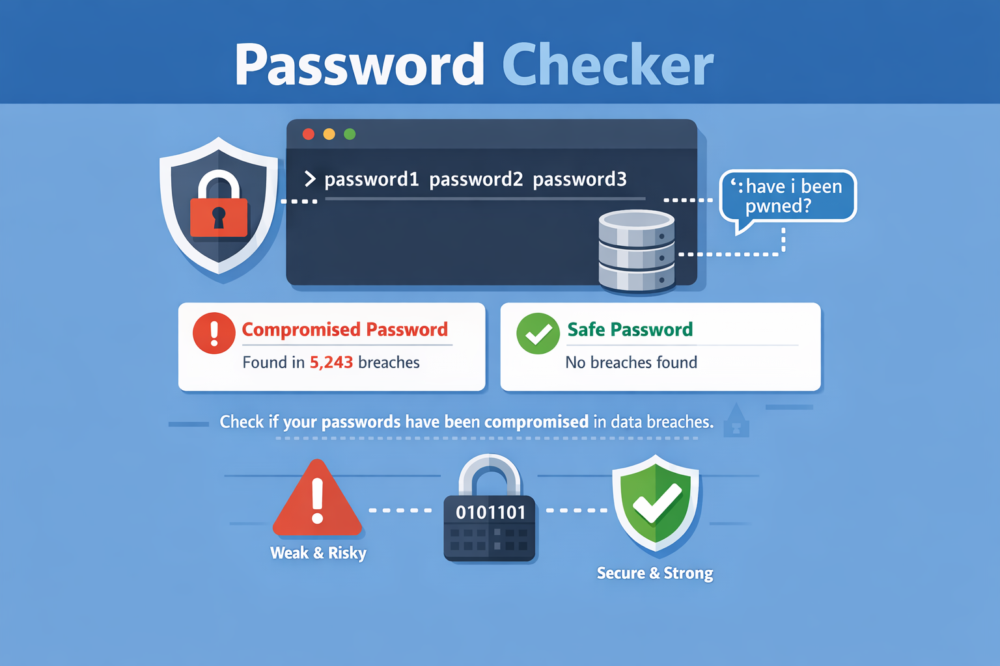
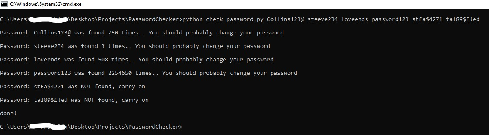

# Password Checker 
 
This program is designed to enhance password security awareness by evaluating the integrity of user-provided passwords.

 It accepts multiple password inputs as command-line arguments and checks each one against a publicly available database of compromised credentials, such as the "Have I Been Pwned" API.

In the above example, 6 passwords were checked,
and for each password, the program determines whether it has appeared in known data breaches and, if so, reports the number of times it has been compromised. This information allows your users to make more informed decisions about their password choices and helps promote better cybersecurity practices.

By automating the process of checking for password vulnerabilities, the program serves as a useful tool for both individuals and organizations aiming to **_audit password strength_** and reduce the risk of account compromise.

# Improvements
This project can be improved in several ways to produce better results and better align with your specific app or software requirements. Possible enhancements include:

* Reading the passwords to be checked directly from a text file.

* Adding more checking levels and more informative feedback messages (e.g., “10 times — fairly good,” “500 times — consider changing this password,” etc.).

